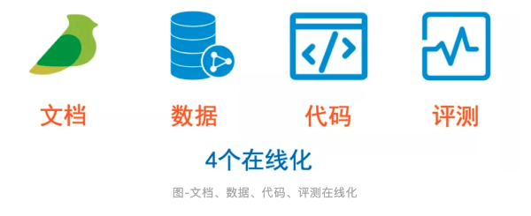

阿里巴巴高级算法专家威视：组建技术团队的一些思考

https://mp.weixin.qq.com/s/gxhqbOIWUSYRxLBsizFD2A

## 团队的定位是什么？——做正确的事

### 讲团队定位

### 制造壁垒与价值

## 团队需要什么能力？

## 采取什么工作模式？——正确地做事

团队之间如何协作的问题

互联网的本质是连接，最大价值也是连接。

团队里一个同学说得很好：相互间建立信任关系的最好办法是发生工作上的协同

常用软件在线化

## 绩效考核

平等性
团队协作的基础是团结，团结的基础是平等。

